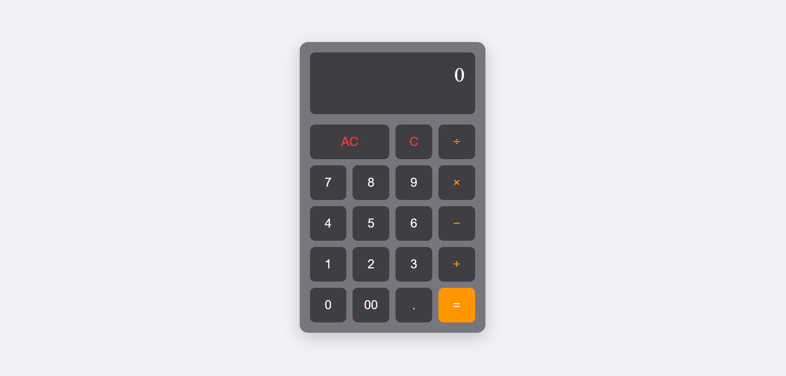

# 🧮 Modern Vanilla JS Calculator

A sleek, responsive, and fully functional web-based calculator built entirely with vanilla web technologies. Designed with a modern dark UI and engineered for a smooth, intuitive user experience.

## 🌟 Features

- **Standard Arithmetic:** Supports addition, subtraction, multiplication, and division.
- **Intelligent Deletion (C):** Easily fix mistakes by deleting the last entered character without losing the entire calculation.
- **All Clear (AC):** Instantly reset the display and ongoing calculations.
- **Decimal Precision:** Safely handles floating-point math and decimal inputs.
- **Responsive Grid:** The keypad is perfectly proportioned using CSS Grid, ensuring it looks great on any screen size.
- **Zero Dependencies:** No frameworks, no build tools, no npm packages. Just pure HTML, CSS, and JS.

## 📸 UI Design
The interface features a sophisticated dark-mode aesthetic with color-coded interactive elements:
- **Dark Gray Body:** Reduces eye strain and looks modern.
- **Vibrant Orange Operators:** Highlights primary mathematical functions (`÷`, `×`, `-`, `+`, `=`).
- **Red Alert Actions:** Clearly distinguishes destructive actions like `AC` and `C`.
- **Active States:** Subtle shrink animations (`transform: scale`) provide tactile feedback when buttons are clicked.



## 🚀 Getting Started

Because this project uses vanilla web technologies, getting it running is incredibly simple.

### Prerequisites
- A modern web browser (Chrome, Firefox, Safari, Edge, etc.)


### Installation & Usage
1. Clone this repository or download the source code.
```bash
git clone [https://github.com/vedantsahoo/simple-calculator.git](https://github.com/vedantsahoo/simple-calculator.git)
```
2. Navigate to the project directory.

3. Open index.html directly in your web browser.
(You can simply double-click the file or drag and drop it into an open browser tab).

### 📁 File Structure
For simplicity and easy sharing, the current version combines all code into a single file.

```bash
# Contains the HTML structure, CSS styling, and JS logic
/
└── index.html
└── css
    └── style.js
└── js
    └── script.js 
```
(If you decide to scale the project, you can easily split this into `index.html`, `style.css`, and `script.js`)

### 🛠️ Built With

- **HTML5:** Semantic structure.
- **CSS3:** Flexbox for centering, CSS Grid for the calculator buttons, and custom styling.
- **JavaScript (ES6):** DOM manipulation, event handling, and calculation logic using a safe implementation of `eval()`.

### 🤝 Contributing
Contributions, issues, and feature requests are welcome! Feel free to check the [issues page](https://github.com/vedantsahoo/simple-calculator/issues) if you want to contribute.

Some ideas for future improvements:
- Add keyboard support (typing numbers instead of just clicking).
- Add a history log to see past calculations.
- Implement scientific functions (square root, exponents, etc.).
